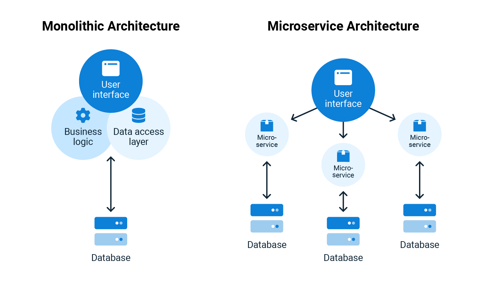

# Define the necessary environment for the automated deployment of services.

**Essential Knowledge:**

## 1. Understands the fundamental principles of both monolithic and microservices architecture.

| **Principle**                                       | **Monolithic Architecture**                         | **Microservices Architecture**                       |
|-----------------------------------------------------|-----------------------------------------------------|-----------------------------------------------------|
| **Decomposition**                                   | Typically a single, unified codebase and database.  | Decomposed into smaller, independent services.       |
| **Scalability**                                     | Scaling involves replicating the entire application | Can scale individual services independently.         |
| **Development**                                     | Centralized development and deployment.              | Decentralized development and deployment.            |
| **Flexibility**                                     | Changes may require modifying the entire codebase. | Easier to make changes to specific services.         |
| **Fault Isolation**                                 | A failure can impact the entire system.              | Failures are contained within individual services.  |
| **Technology Stack**                                | Homogeneous technology stack.                        | Can use different technologies for different services.|
| **Communication**                                   | In-process communication between components.        | Inter-service communication through APIs.            |
| **Deployment**                                      | Deployed as a single unit.                           | Independent deployment of individual services.      |
| **Scalability**                                     | Vertical scaling (increasing resources of a single unit). | Horizontal scaling (adding more instances of specific services). |

**Monolithic Architecture:** 
Imagine you have a big LEGO castle. All the pieces of the castle, like the walls, towers, and doors, are connected together to make one huge castle. If you want to change something, like add a new tower, you have to touch the entire castle. It's like playing with a giant, single LEGO set where everything is stuck together.

**Microservices Architecture:** 
Now, think about having lots of smaller LEGO sets, each representing a different part of the castle - one for walls, another for towers, and so on. These sets can work together, but they are separate. If you want to change one part, like add a new tower, you only need to change that specific LEGO set without touching the rest. It's like building a big castle with many smaller, independent LEGO sets.

So, in simple terms:

- **Monolithic**: One big LEGO castle where all pieces are stuck together.
- **Microservices**: Many smaller LEGO sets, each representing a specific part, and they can work together to build something big.

## 2. Recognizes the key advantages and disadvantages of different architectures and demonstrates their impact on a service level (e.g., microservices architecture).

| Architecture            | Advantages                                 | Disadvantages                              | Impact on Service Level                    |
|-------------------------|--------------------------------------------|--------------------------------------------|--------------------------------------------|
| Monolithic              | - Simplicity in development and deployment  | - Lack of scalability                      | - Limited scalability                      |
|                         | - Easier debugging and testing             | - Longer development cycles               | - Longer development cycles               |
|                         | - Centralized data management             | - Limited technology flexibility          | - Limited technology flexibility          |
|                         |                                            | - Higher risk of system failures          | - Higher risk of system failures          |
| Microservices           | - Improved scalability and flexibility    | - Increased complexity                    | - Enhanced scalability                    |
|                         | - Independent service development         | - Higher operational overhead             | - Improved fault isolation                |
|                         | - Technology stack flexibility            | - Distributed system complexities         | - Easier updates and deployments          |
|                         |                                            | - Challenges in data consistency          | - Efficient resource utilization          |

## 3. Knows the process of packaging services into containers.

1. **Containerization Technology Selection:**
   Choose a containerization technology such as Docker or Kubernetes based on project requirements.

2. **Containerizing Application Code:**
   Write Dockerfiles or Kubernetes manifests to define the application's dependencies, configurations, and runtime environment.

3. **Building Container Images:**
   Use containerization tools to build container images from the defined specifications. This involves creating a snapshot of the application and its dependencies.

4. **Container Image Registry:**
   Store the built container images in a container registry, providing a centralized location for versioning and distribution.

5. **Container Orchestration (Optional):**
   If using a container orchestration tool like Kubernetes, define deployment configurations to manage containerized applications at scale.

6. **Networking and Service Discovery:**
   Set up networking configurations to enable communication between containers and implement service discovery mechanisms for dynamic environments.

7. **Security Measures:**
   Implement security practices such as image scanning, user privilege management, and network policies to ensure a secure containerized environment.

8. **Continuous Integration/Continuous Deployment (CI/CD):**
   Integrate containerization into the CI/CD pipeline for automated testing, building, and deployment of containerized services.

9. **Monitoring and Logging:**
   Configure monitoring and logging tools to track the performance, resource utilization, and potential issues of containerized services.

10. **Scaling and Load Balancing:**
    If necessary, set up mechanisms for automatic scaling and load balancing to optimize resource utilization and ensure high availability.

## 4. Understands the procedures for deploying services in the backend and how these services are utilized in the frontend by clients.

1. **Containerization:** Services are often packaged into containers, ensuring consistency across different environments. Docker is a popular tool for creating and managing containers.

2. **Container Orchestration:** Tools like Kubernetes manage the deployment, scaling, and operation of application containers, ensuring efficient utilization of resources.

3. **Continuous Integration/Continuous Deployment (CI/CD):** Adopting CI/CD pipelines automates the process of testing, building, and deploying services, facilitating rapid and reliable deployments.

4. **Service Discovery:** Backend services need to register themselves and be discoverable by other services. Tools like Consul or etcd help in service discovery within a distributed system.

5. **Load Balancing:** Distributing incoming network traffic across multiple backend servers ensures optimal resource utilization and prevents overload. Load balancers like Nginx or HAProxy are commonly used.

6. **API Gateways:** An API gateway acts as a single entry point for managing and routing API requests. Tools like Kong or AWS API Gateway help in managing frontend-to-backend communication.

As for frontend utilization by clients:

1. **API Consumption:** Clients interact with backend services through well-defined APIs. These APIs expose endpoints that clients can call to perform specific actions or retrieve information.

2. **Frontend Frameworks:** Utilizing frontend frameworks like React, Angular, or Vue.js allows clients to efficiently consume and display data from backend services.

3. **Asynchronous Communication:** Techniques like WebSocket communication or asynchronous HTTP requests (AJAX) enable real-time updates and responsive user interfaces.

4. **Authentication and Authorization:** Secure communication is facilitated through authentication mechanisms (e.g., OAuth) to ensure that only authorized clients can access specific services.

5. **Caching:** Frontend applications often use caching mechanisms to optimize performance by storing frequently accessed data locally, reducing the need for repeated requests to the backend.

In summary, the backend deployment involves containerization, orchestration, CI/CD, service discovery, and load balancing. Frontend utilization by clients includes API consumption, frontend frameworks, asynchronous communication, authentication, authorization, and caching.

## 5. Familiar with the underlying architecture of a container environment (Daemon, Client/Server, Images, Container, Registry).

- **Daemon:** Refers to a background process that runs on a host system, managing container-related tasks and interactions.

- **Client/Server Structure:** Denotes the relationship between the Docker client (user interface) and the Docker daemon (background process), illustrating the communication model.

- **Images:** Immutable, lightweight, standalone, and executable packages that include application code, runtime, libraries, and system tools necessary for running an application.

- **Container:** An isolated and executable environment that encapsulates an application and its dependencies, providing consistency across various environments.

- **Registry:** A centralized repository for storing and managing container images, facilitating their distribution and deployment across different systems.

## 6. Understands the dependencies of services and their deployment in a local infrastructure (examples: persistent data storage, networking, and others).

- **Persistent Data Storage:** This encompasses the strategy and mechanisms for storing data persistently, ensuring that data remains available even after services or systems restart. Common technologies include databases and storage solutions.

- **Networking:** Refers to the configuration and management of communication pathways between different services and components within the local infrastructure. It involves considerations such as protocols, routing, and network security.

- **Other Dependencies:** Encompasses various dependencies that services might have, including external libraries, APIs, or frameworks. Managing these dependencies ensures smooth functioning of the services in the local infrastructure.
